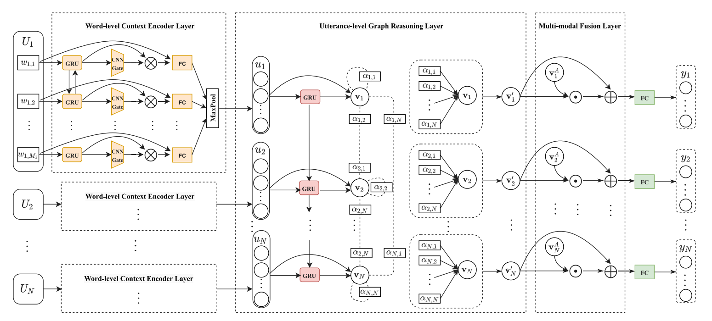

# GAR-Net

Pytorch implementation for codes in [GAR-Net: A Graph Attention Reasoning Network for Conversation Understanding](https://www.sciencedirect.com/science/article/pii/S0950705121011400)

## Model


### Run the Code
```
python train.py
```

## Citation
```
@article{XU2022108055,
title = {GAR-Net: A Graph Attention Reasoning Network for conversation understanding},
journal = {Knowledge-Based Systems},
volume = {240},
pages = {108055},
year = {2022},
issn = {0950-7051},
doi = {https://doi.org/10.1016/j.knosys.2021.108055},
url = {https://www.sciencedirect.com/science/article/pii/S0950705121011400},
author = {Hua Xu and Ziqi Yuan and Kang Zhao and Yunfeng Xu and Jiyun Zou and Kai Gao},
keywords = {Conversation understanding, Convolution gate, Graph reasoning, Cross-modal}
}
```

